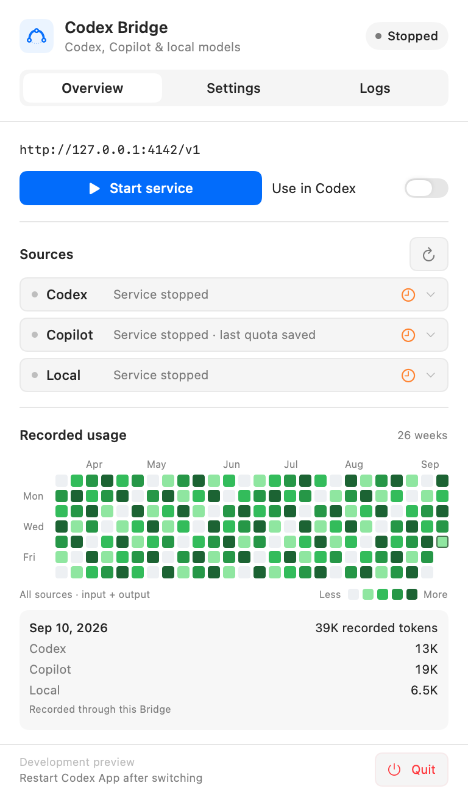

# Codex Bridge


A native **Apple Silicon macOS menu-bar app** that gives **Codex App** one model
picker for **Codex subscription, GitHub Copilot, and a local Unsloth Studio API**.
Codex App still owns the task, history, context management, tool execution and
permissions. This is a model gateway, not a second coding agent.

> **Local review build, not a published release.** The `codex/codex-bridge`
> development branch produces `build/Codex Bridge.app` and
> `build/Codex-Bridge-arm64.zip`. The existing Homebrew cask and public releases
> still refer to the older Copilot-only app. Do not use them to evaluate this branch.
> Nothing is installed, uploaded or published by the local build script.

<picture>
  <source media="(prefers-color-scheme: dark)" srcset="docs/screenshots/overview-dark.png">
  
</picture>

## Connect the sources

Requires macOS 14+ and Apple Silicon. No separate Bun installation is needed to
run the packaged app. It lives in the menu bar, not the Dock.

1. Review **Settings > Model sources**. Enable the sources you want. For Local,
   enter the Unsloth API base URL, or its full `/v1/responses` URL. No model name
   or context-window entry is required.
2. **Start service** on a free port. An existing listener is never stopped or
   taken over. Source discovery does not load or download a model.
3. Expand **Codex** in Overview to connect an independent subscription account
   using browser or device-code sign-in. The app uses Pi's OAuth implementation
   and its own Keychain entries, not Codex App's `auth.json` or a nested CLI session.
4. Copilot reuses the established GitHub device flow and Bridge credential cache.
   **Settings > GitHub account > Authorize GitHub…** starts a new authorization;
   it is not sign out. Stop this app's service and any standalone Bridge before
   replacing that shared GitHub authorization.
5. If the local endpoint requires a key, save/restart after configuring its URL,
   then use **Store key**. Keys are bound to the exact normalized endpoint in
   Keychain; they do not follow a change to another host or port.
6. Turn on **Use in Codex**, then fully quit and reopen **Codex App**. Select a
   source-labelled model there. This app does not restart Codex or its tasks.

Source IDs are unambiguous: `codex/<model>`, `copilot/<model>`, and `local/<model>`.
A missing source/model does not fall back to another account or billing source.
Bare historical model names work only in a Copilot-only catalog, or when a task
has already established a source. Unknown background routes fail explicitly.

## Local capabilities and limits

Unsloth discovery uses its public models/props APIs and publishes loaded
conversational models with a reported **runtime context window**. ASR, image,
unloaded, and window-unknown models are excluded. Vision, tool and parallel-call
badges describe server declarations, not a quality guarantee. Runtime window,
quantization/build or capability changes invalidate the previous fingerprint.
Refresh/reopen Codex App when its cached picker is stale.

The local adapter preserves function namespaces and custom `apply_patch`, image
input, and images in tool results. Workstation tools run in Codex App, **not on
the Unsloth machine**. Readable reasoning/search history is retained explicitly;
opaque/encrypted history and unsupported file attachments fail rather than being
dropped. Start a new task when moving a task with provider-private history.

Search is provider-specific:

- **Codex:** native official Responses tools are forwarded intact.
- **Copilot:** its existing search and model-specific compatibility pipeline is
  retained, including its explicit backend configuration.
- **Local:** a guarded hosted-tool adapter asks Studio to run only its native
  `web_search`. It requires real `tool_start`/`tool_end` evidence; generated URLs
  or textual tool markup are not counted as a successful search. No external
  search subscription is selected automatically. Cached-only search and unsupported
  location/domain filters fail explicitly when invoked; they are not changed to
  unrestricted live search. Ordinary tasks still work with Codex's default tool list.

**Acceptance status is not universal compatibility.** The local synthetic suite
covers streaming, function round-trips, vision, tool-result screenshots, custom
patches and client cancellation. A real isolated Codex engine also performs a
read-only file-tool task through the gateway. Full desktop Computer Use, immediate
GPU cancellation, and a live subscribed Codex account remain separate acceptance
checks. The tested local service did not return executed native-search results.
See [verification](docs/verification.md) and the local build's acceptance report.

## Activity and account quotas

One green **26-week heatmap** sums recorded input + output tokens across all three
sources. Cached input is not added twice. Hover, focus or select a day for the
total and **Codex / Copilot / Local** breakdown. Visual tile gaps remain, but hover
coverage has no gaps. Missing/partial counters are labelled, not measured as zero.

The three compact **Sources** rows replace the large single-account credit card.
Expand a row for details. Codex quota windows use percentages and reset times;
Copilot uses the returned credit/premium-interaction units; Local has no
subscription balance. Account quotas include other clients; the heatmap includes
only requests observed by this Bridge. Credits from different providers are
never summed or converted into dollars. Cached quotas retain their observation
time and are not shown as freshly connected data after the service stops.

Copilot's actual request billing (`total_nano_aiu / 1,000,000,000`) continues to be
stored separately, but is no longer mixed into the all-source heatmap's details.
See [activity and migration](docs/activity.md).

## Safe configuration switching

The toggle edits the root provider and its own managed block in Codex's
`config.toml`, with verified private backups, a journal, file locking and atomic
replacement. It retains `requires_openai_auth = true` and disables unsupported
WebSockets. It does not read/write Codex authentication files.

Turning off restores the previous provider. Ordinary unrelated model/config edits
are preserved. A **Bridge-qualified** model selected while enabled is restored
from the verified pre-Bridge snapshot (or removed if there was no old model), so
`local/...` is not accidentally sent to OpenAI after disabling the gateway.
Edits to managed fields, invalid TOML or corrupt backups fail closed.

The resolved target and **Open backups** are in Settings. Routing persists when
Bridge quits; switching it off is an explicit operation. See
[configuration and recovery](docs/configuration.md).

## Privacy and lifecycle

- No service, task or configuration is changed by building or installing the app.
- Start/stop/restart controls act only on the app's own child process.
- Optional startup uses the normal macOS login-item setting. First launch does
  not automatically start the backend.
- **LAN mode is intentionally keyless and uses plain HTTP.** Use a trusted network
  only; never expose it to the internet. Any device on that LAN can consume enabled
  account quotas. Private management routes require a per-process secret, and
  browser-origin model requests are rejected.
- A local API configured with HTTP also sends its traffic/key without TLS. Use
  HTTPS whenever it leaves a trusted network.
- No prompts, screenshots or generated text are written to the usage database.
  Logs are bounded/redacted, but review diagnostics before sharing them.
- Repository names, bundle ID, executable name, data directory and historical
  config ownership markers intentionally stay compatible with existing installs.

```text
~/Library/Application Support/CopilotBridgeMenuBar/
  settings.json                 # non-secret app preferences
  gateway-settings.json         # non-secret child settings
  usage.sqlite                  # provider/day/model aggregates and quota snapshots
  usage.sqlite.before-providers-v2*.sqlite  # immutable migration snapshots
  credentials.lock              # OS lock, not credentials
  Logs/bridge*.log               # bounded diagnostics
  CodexConfig/                  # private config backups and recovery journal
~/.local/share/copilot-bridge/github_token  # existing GitHub credential cache
macOS Keychain                  # independent Codex OAuth and endpoint-bound local key
```

Configuration backups can contain pre-existing secrets. **Never upload backups,
local reports, credentials or personal diagnostic logs.** Migration snapshots and
legacy tables are retained for recovery; ordinary active aggregates retain 730 days.

## Build and test locally

Use the recorded core submodule commit. A dirty or unrecorded submodule is rejected;
building never rewinds it. Local review commits need not be pushed.

```sh
(cd vendor/copilot-bridge && bun install --frozen-lockfile --ignore-scripts)
bun vendor/copilot-bridge/node_modules/typescript/bin/tsc --noEmit
bun test backend
(cd vendor/copilot-bridge && bun test && bun run typecheck)
swift test --disable-sandbox
python3 scripts/test-english.py
python3 scripts/test-icon.py
bash scripts/build-app.sh
python3 scripts/verify-app.py --app 'build/Codex Bridge.app' --version 0.5.0
```

Build requirements: Apple Silicon Mac, Swift 6+, Python 3, Bun 1.4.1. Native targets
have no remote package dependencies. The icon retains the app's bridge mark and
menu-bar template tinting for light/dark appearances. Local signatures are ad-hoc;
Apple notarization is **not** claimed. Security protections are not disabled.

Fixture tests use temporary homes and non-4142 ports. Live local tests are opt-in
scripts in the core checkout; they require an explicitly supplied API URL and
send synthetic data only. Do not run release/Homebrew installation scripts during
local acceptance.

[Architecture](docs/architecture.md) · [Activity](docs/activity.md) ·
[Configuration](docs/configuration.md) · [Verification](docs/verification.md) ·
[Release boundary](docs/releasing.md) · [Security](SECURITY.md)

## License

MIT © 2026 hyspace. Copilot Bridge core is based on MIT-licensed work by betaHi and
contributors. Pi OAuth is MIT-licensed. Bundled runtime/dependencies retain their
licenses; see `THIRD_PARTY_NOTICES.md` and the packaged notices.
